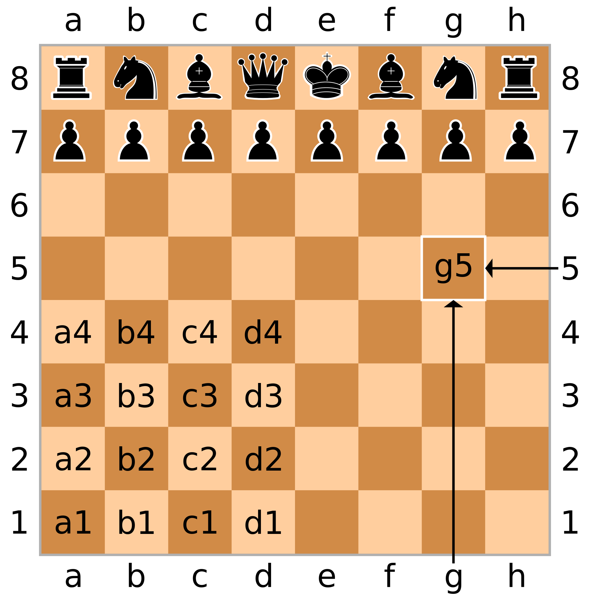

Before we can train a computer to explain chess moves, we first need to communicate the board state to it.
How many pieces are still on board, who's turn is it and what was the last move?
The easiest solution is to simply take a picture of the board before and after a move and let the neural network train on this.
Yet forcing the computer to interpret an image made up of thousands (possibly millions) of pixels just to gleam the position of 32 figures on an 8x8 board seems overkill.
Instead, let's have a look both at more compact methods to save a board state.

### The basics
A modern chess board consist of 64 chequered squares arranged in a 8x8 grid.
Two players each have 16 pieces which start on their respective side of the board.
The goal is to checkmate the opponents king.
For a more detailed explanation of the pieces and the rules I refer to the excellent tutorial by [chess.com](https://www.chess.com/learn-how-to-play-chess).  

### One-hot-encoding each position
A 8x8 grid makes the possible number of positions sound fairly small.
Why not just assign a unique id to each board state?
Unfortunately, doing quick napkin math reveals the number of possible combinations to be incredibly high.

Assuming every piece can reach every position (which is not true but we are just making an estimate) this means we have 64 positions per piece.
The 16 pieces of a player can therefore make up $ 64^16 $ board states.
Admittedly not all of the 16 pieces of a player are unique (in fact only two are). So lets take only a third of this number as our actual result.
Now we still have to account for the other player resulting in $ \frac{64^{16}}{3}^2 = 6.97 * 10^{56} $ possible board states.
Looking at literature, our quick estimate is fairly close to what other came up with [[1]](https://content.iospress.com/articles/icga-journal/icg19-3-05).
So one-hot-encoding is a no-go.

### Algebraic chess notation

Looking at a chess board you may notice the letters underneath each column and the numbers next to each row.
These can be used to reference each square forming the basis for most human chess notations.

The most widely used one is the "algebraic chess notation".
First used by Philipp Stamma in his 1937 published "The Noble Game Of Chess" [[2]](https://books.google.de/books?id=IxpZAAAAYAAJ&printsec=frontcover&hl=de&source=gbs_ge_summary_r&cad=0#v=onepage&q&f=false) it has become the standard for most modern chess tournaments.  
A move is described by combining the initials of the piece and the destination square (i.e. Be5 = bishop to e5).
I once again refer you to [chess.com](https://www.chess.com/article/view/chess-notation#algebraic-notation) if you want to learn more about this notation.

For us, even the basics make it clear that this notation is not suitable for our project.
To generate a useful caption the computer needs to know not just the last move but also the position of all other pieces.
In the algebraic notation, this information can only be gained by playing out all previous moves making it useless to capture just a snapshot of the board state.

### Forsyth-Edwards notation
This also hold true for most other human-readable notations (i.e. [ICCF numeric notation](https://en.wikipedia.org/wiki/ICCF_numeric_notation), [descriptive notation](https://en.wikipedia.org/wiki/Descriptive_notation)).
One notable exception is the Forsyth-Edwards notation.
It captures the board state in a single line.
For example, the starting position would look as follows:

~~~
rnbqkbnr/pppppppp/8/8/8/8/PPPPPPPP/RNBQKBNR w KQkq - 0 1
~~~

However, if we pass thi notation into a neural network we have to translate each letter into a number.
Furthermore, the network would need to understand the notation as part of its training making the whole process more complex.
Thus I decided against using this method even though it is very concise.

In the next post I will look at notations that are not human-readable but better suited for a computer.

