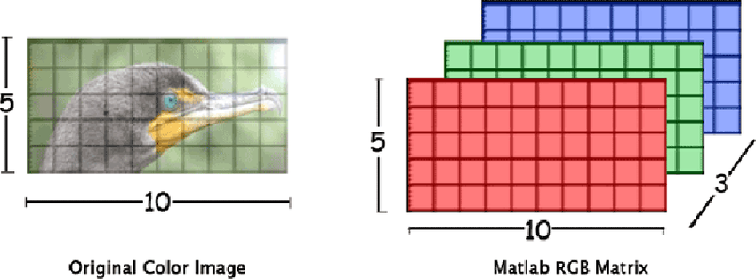

Nowadays most chess engines play much better than any human player.
Part of getting engines like [Stockfish](https://stockfishchess.org/) and [AlphaZero](https://deepmind.com/blog/alphazero-shedding-new-light-grand-games-chess-shogi-and-go/) to be this good was figuring out a good way to represent a board.
Why not just use one of these representations [[1]]((https://www.chessprogramming.org/Board_Representation))?

Unfortunately, not all of these are suitable for our project. In fact, most of the are not.
As part of each move, chess engines have to make numerous checks (i.e. is anyone giving check).
Being able to calculate these things in a computationally efficient way is key since competitive chess is played on a timer.
Thus, most modern board representations are designed to allow for such quick checks (i.e. needing only one bitwise operation to determine if diagonal is open [[2]](https://www.chessprogramming.org/0x88)).

For us, such things are irrelevant. Instead, we are looking for the representation that is best understood by the computer.
In theory, a neural network can understand any notation but the more complex the representation, the more data and time will be needed just to teach this representation to the network. Since we have only very limited amounts of data it is worth spending some time looking for a good notation.

### The board as a matrix
In the previous chapter I said the chess board is made up of 8x8 chequered squares.
For mathematicians (or any one who passed 9th grade) the first things that comes to mind is a matrix.
Why not represent the board as one?

Something like this where the number stands for a certain piece and $ i_{11} $ maps to the top left of the board:

$$ \begin{bmatrix} -5 & -2 & -3 & -7 & -9 & -3 & -2 & -5 \\ -1 & -1 & -1 & -1 & -1 & -1 & -1 & -1 \\ 0 & 0 & 0 & 0 & 0 & 0 & 0 & 0 \\ 0 & 0 & 0 & 0 & 0 & 0 & 0 & 0 \\ 0 & 0 & 0 & 0 & 0 & 0 & 0 & 0 \\ 0 & 0 & 0 & 0 & 0 & 0 & 0 & 0 \\ 1 & 1 & 1 & 1 & 1 & 1 & 1 & 1 \\ 5 & 2 & 3 & 7 & 9 & 3 & 2 & 5 \end{bmatrix} $$

Even better, we can convert the categorical values for each piece into one-hot-encoded vectors.
Depending on whether we:
* see the black and white pieces as different vectors (i.e. $ \text{white pawn} = \begin{bmatrix} 1 & 0 & 0 & ... \end{bmatrix} $, $ \text{black pawn} = \begin{bmatrix} 0 & 1 & 0 & ... \end{bmatrix} $)
* or just take the negative value of each white piece vector for the black pieces (i.e. $ \begin{bmatrix} 1 & 0 & 0 & ... \end{bmatrix} $ and $ \begin{bmatrix} -1 & 0 & 0 & ... \end{bmatrix} $)

we get a matrix of 8x8x12 or 8x8x6.

This representation looks very similar to how we represent images.
Only instead of having three color channels, we have 12.

This parallel makes me very hopeful.
State-of-the-art neural networks excel at generating captions for images.
However, I don't want to be hasty.
Let's have a look at a few other representations before we make a decision.

### Piece lists
An alternative to the board centric matrix view would be to start with the chess pieces.
For each piece, we can then denote the position as either an absolute value (from 1 to 64), a one-hot-vector for each position or two indices (in an 8x8 matrix).
By concatenating each vector we once again form a matrix but this time the focus is on the pieces (i.e. the first row stand for the black knight).

$$ \begin{bmatrix} 1 & 1 \\ 1 & 2 \\ 1 & 3 \\ ... \end{bmatrix} $$

This notation is much more memory efficient but it makes it hard to determine which spaces are empty.
Thus, it could be a possible fallback if the matrix notation is to computationally expensive.

### Limitations
All the representations I looked at so far do not fully capture the board state.
Besides the position of the pieces you need to know if it is still possible to castle, whether a pawn can be captured en passant and a few more things.
However, I will (initially) ignore everything but the pieces because most explanations can be generated just by looking at the pieces.

One exception is the last move.
We are trying to generate a caption for this move, we need to know what it was :).
Fortunately, state-of-the-art neural networks for caption generation can consider a "context" in addition to the image.
This context contains further information an can be used to inform the model about the latest move.

### Moves as words
Last chapter I argued that human move representations are not suitable for this project.
This holds true if we solve this task using common image caption generation approaches.
However, if we take another look at the algebraic notation, this time from an NLP perspective you may notice something interesting.

1. e4 e5 2. Nf3 Nc6 3. Bb5 a6

Each move is a word and putting them one after the other we can form a sentence that describes each move that was made so far.
Anyone familiar with NLP knows that this is a prime use case for one-directional RNNs.
If we encode the game state using the output from an LSTM or GRU this task suddenly becomes a machine translation project.
We read in the chess notation and "translate" it to the explanation for the last move.

Both the matrix representation and the NLP approach look very promising.
How can we decide which one is best?
In the next few chapters I will devise an unsupervised training scenario to evaluate both.
