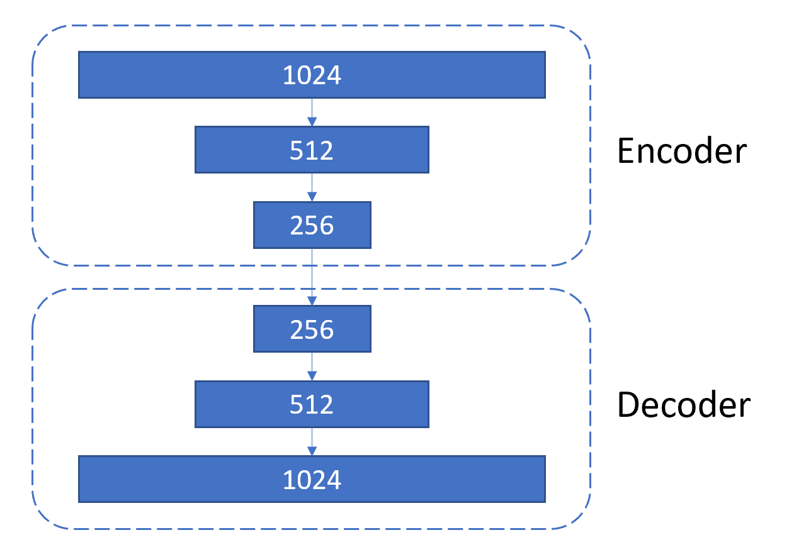
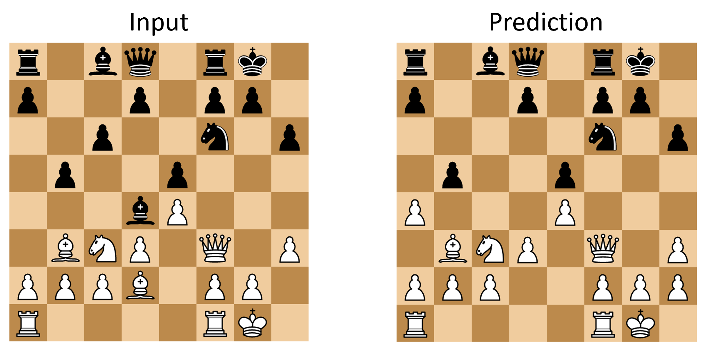
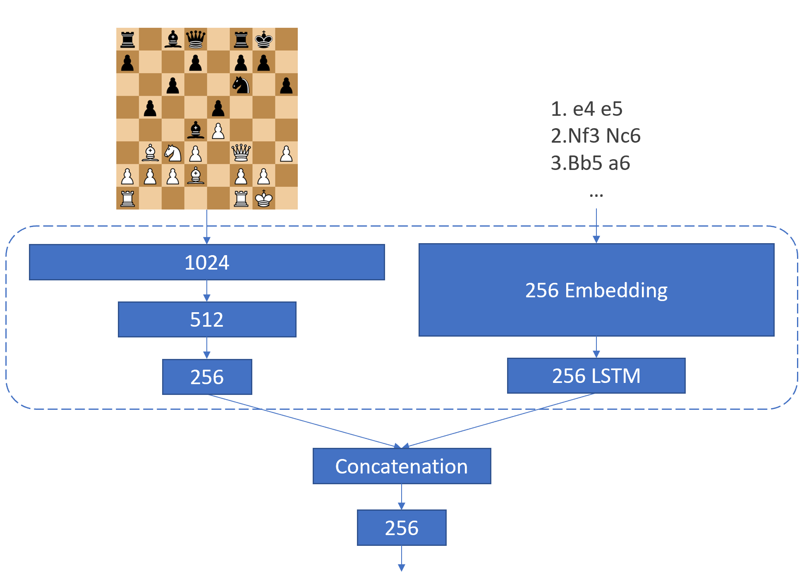

So far, we have selected two data encodings and two data sets.
In this post, we will train an Autoencoder to test them.

### What's an Autoencoder?
Autoencoders are unsupervised models via which an encoding can be taught to a neural network.
Often, you have only a small labeled data set. That's why you want your model to already "understand" the encoding when you start training.
Think of it like this: before teaching a model to recognize faces, why don't we first teach it what a face looks like in general?
That's the idea behind Autoencoders.

In our case, we want the model to understand a chess position before we try to generate captions.
Furthermore, we have a large, unlabeled data set, perfect for unsupervised training.

### Matrix representation
For the matrix representation, we can use a simple Encoder-Decoder.
Usually, this architecture is used with multiple CNNs which extract patterns from the image. 
However, we don't need this since the matrix representation already consists of patterns (i.e. we denote a pawn directly).
There is no need to aggregate this further.
Instead, the matrix is simply flattened and fed through three linear layers with ReLU activation.
The Decoder reverses this process and the resulting matrix is compared with the input matrix.

In code this looks like this:

~~~ python
from keras.models import Model
from keras.layers import Dense, Activation, Input, Flatten, Reshape

def Encoder():
    X = Input(shape=(8, 8, 12))
    f = Flatten()(X)
    d1 = Dense(512, activation='relu')(f)
    d2 = Dense(256, activation='relu')(d1)
    d3 = Dense(128, activation='relu')(d2)
    return Model(X, d3)

def Decoder():
    X = Input(shape=(128,))
    d1 = Dense(256, activation='relu')(X)
    d2 = Dense(512, activation='relu')(d1)
    d3 = Dense(8*8*12, activation='relu')(d2)
    r = Reshape((8, 8, 12))(d3)
    return Model(X, r)

# define input to the model:
X = Input(shape=(8, 8, 12))

# make the model:
autoencoder = Model(X, Decoder()(Encoder()(X)))

# compile the model:
autoencoder.compile(optimizer='adadelta', loss='binary_crossentropy')
~~~

Check out [this](https://github.com/RobinWeitzel/nn-project/blob/master/autoencoder.ipynb) notebook for the full code.
Note that I had to use a data generator which loads batches of data at runtime because loading all the games in their matrix representation at once would take up to much memory.
Besides that, I encountered an bug in keras when using "fit_generator".
Usually, the function should write all output in one line overwriting the old line.
Instead, keras kept writing new lines.
Fortunately, I found [this](https://github.com/bstriner/keras-tqdm) great library which uses tqdm to visualize the training process.

Running the model on a laptop GPU took about an hour after which it achieved 96% validation accuracy.
This is excellent though not as good as it sounds.
A chessboard has 32 pieces on a 64 square board.
Therefore, when comparing two boards at least 32 squares are always empty on both boards.
This drastically inflates the accuracy.
If we do not count these empty squares and only check if the pieces were in the same position in the input board and the output board the accuracy decreases to 86%.
Still good but not great.

Taking a look at a concrete example we can see that most pieces are in the same position but a few were "forgotten".
Looking at a few more examples it seems the model never misplaces pieces.
Either they are position correctly or they are not present at all.

Overall, the first test is encouraging but I wanted to see if we can not improve the results by using the second representation.

### Move list
A list of move in its own is very difficult to train on if we want to know the current board state.
The model would have to understand what each move means and "visualize" the resulting board positions in it's "head".
If you were given just a list of moves and asked to say what the final board state looks like you would be hard pressed unless your a grand master.
Furthermore, RNNs can only remember a fixed number of words.
In a long game, early moves would simply be forgotten.

Therefore, instead of using just the move list I wanted to augment the above model by feeding in the list in addition to the current board state.
To encode the moves, I first embed them as vectors of length 256. Then I feed the list of moves through an LSTM.
The output from the LSTM is concatenated with the output from the matrix encoder and then fed through a final linear layer.

The modified Encoder looks like this:

~~~ python
def Encoder():
    matrix = Input(shape=(8, 8, 13))
    moves = Input(shape=(600,))
    
    x = Flatten()(matrix)
    x = Dense(1024, activation='relu')(x)
    x = Dense(512, activation='relu')(x)
    x = Dense(256, activation='relu')(x)
    x = Model(inputs=matrix, outputs=x)
    
    y = Embedding(5871, 256)(moves)
    y = LSTM(256, activation='relu', return_sequences=False)(y)
    y = Model(inputs=moves, outputs=y)
    
    combined = concatenate([x.output, y.output])
    
    z = Dense(256, activation='relu')(combined)
    
    return Model(inputs=[x.input, y.input], outputs=z)
~~~

The full notebook can be found [here](https://github.com/RobinWeitzel/nn-project/blob/master/autoencoder2.ipynb).
Training this model took very long, even on a GPU.
I had to split the data into multiple batches to spread the training over multiple sessions.
Replacing the LSTM with a GRU reduced the training time but not significantly.
I also tried to use a Google Tensor Processing Unit (TPU) but keras does not support using TPUs on models with multiple inputs :(

The model plateaued at 66%, far below the performance of our first model.
Most likely, modifying the move encoder would have yielded better results.
However, because training the Encoder took so long after each adjustment I abandoned this approach and settled on just using the matrix representation.
I still think encoding the moves as words is an interesting idea worth further consideration in a follow-up project but for now we stick with something that is easier to train and fine tune.

Thus, we have a model capable of encoding a board state.
The next step is to test if it can also encode a move.
This is critical to generate a move description.
After all, just looking at a chess board, how can we describe the last move?
Therefore, the next post will describe my efforts to generate captions that just say what the last move was.