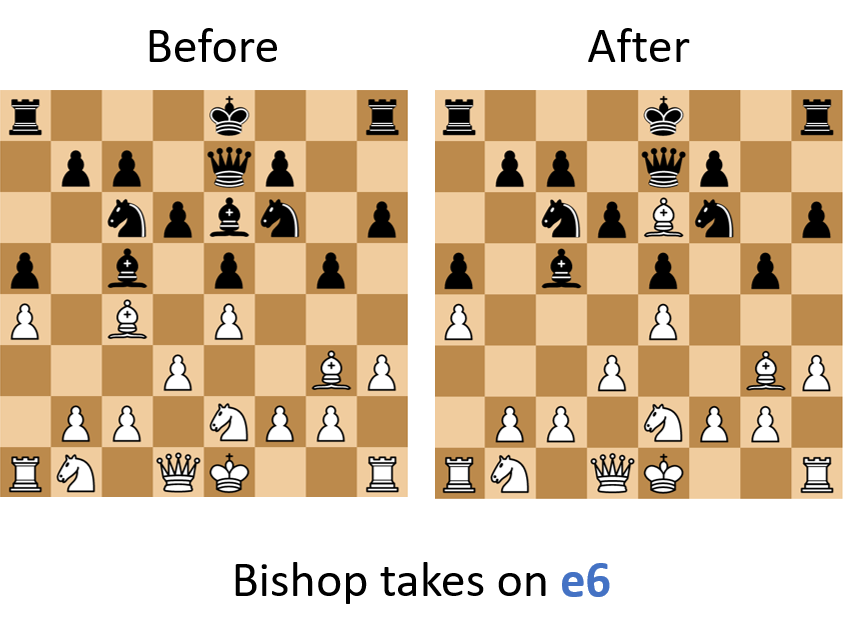
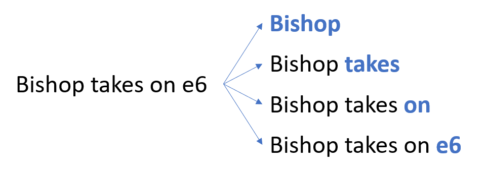
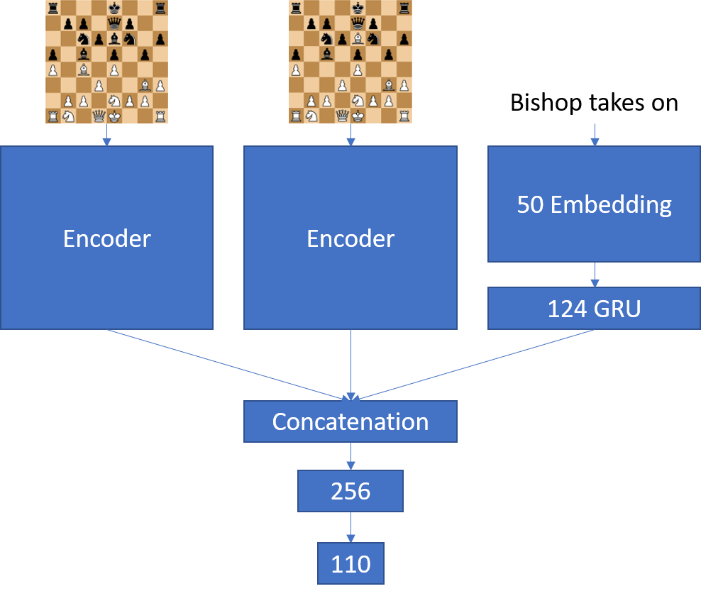

In this post, I want to train a network to say what the last move was by showing it the board state before and after the move.
This task can easily be done by traditional, non-neural chess engines.
However, it showcases that our model can not just recite a chess board (see last post for more info about this) but also interpret it.
That's critical for our last step, generating explanations for moves.

### Data preparation
The input data to our model will be the board state before and after a move.
In addition, we will input the words that have been generated so far and predict the next word (marked in blue).

Fortunately, we can combine the move lists (that we initially generated as a form of representation) with our matrix notation to generate data in the required format.
Because the move list uses the algebraic notation (i.e. Be4) but we want a sentence (i.e. Bishop to e4) I wrote a transformer:

~~~ python
def pieceToWord(notation, verbose=False):
    '''
    Returns a short sentence describing a piece and its position
    '''
    
    pieces = {
        "B": "Bishop",
        "R": "Rook",
        "K": "King",
        "Q": "Queen",
        "N": "Knight"
    }
    
    length = len(notation)
    
    if length == 0:
        return "Pawn"
    
    if length == 1:
        if notation.islower(): # Pawn
            if verbose:
                return "Pawn from file " + notation
            else:
                return "Pawn"
        else: # Higher piece
            return pieces[notation]
    
    piece = pieces[notation[0]]
    
    if not verbose:
        return piece
    
    if length == 2:
        if nontation[1].isdigit(): # rank
            return piece + " from rank " + nontation[1]
        else: # file
            return piece + " from file " + nontation[1]
    
    if length == 3: # rank and file
        return piece + " from square " + nontation[1:] 

def moveToSentence(move, verbose=False):
    '''
    Translates a move in the algebraic notation into a caption.
    '''
    
    pieces = {
        "B": "Bishop",
        "R": "Rook",
        "K": "King",
        "Q": "Queen",
        "N": "Knight"
    }
    
    action = " to " # Default action is move
    modifier = "" # Default no modifier
    
    if "+" in move: # Check
        if verbose:
            modifier = " with check"
        move = move[:-1]
    
    if "#" in move: # Checkmate
        if verbose:
            modifier = " with checkmate"
        move = move[:-1]
        
    if "=" in move: # Pawn promotion
        if verbose:
            modifier = " with promotion to " + pieces[move[-1:]].lower() + modifier
        move = move[:-2]
    
    # Special cases
    if "O-O" in move: # Kingside caste
        return "Kingside castle" + modifier
    
    if move == "O-O-O": # Queenside castle
        return "Queenside castle" + modifier
    
    if "e.p." in move: # En passant
        move = move.replace('e.p.', '')
        move = move.split('x')[1]
        if verbose:
            return "Pawn takes on " + move + " en passant"
        else:
            return "Pawn takes on " + move + ""
        
    # extract final position
    position = move[-2:]
    move = move[:-2]
        
    if "x" in move: # Capture
        action = " takes on "
        move = move[:-1]
        
    piece = pieceToWord(move, verbose)
    
    return piece + action + position + modifier
~~~

This yielded a dataset of around 5.5 million moves with captions.
Next, I further separated this dataset to so that each word is shown as the output once.

However, this might cause issues down the road.
Right now, we weigh each word equally.
The word "to" is just as important as the word "e4" but the word "to" is much more likely to come up.
We have 64 possible squares and 6 different pieces but a piece can only move ("to") or capture ("take").
This imbalance will make the model focus less on getting the actual position and piece right.
Therefore I added each tuple that predicts a position five times and each tuple predicting a piece twice into the dataset.
We end up with almost 47 million annotated moves.

### Model
As mentioned above, our model has three inputs:
* the board state before the move
* the board state after the move
* all words of the sentence before the word we are trying to generate

To encode the board states we use the pretrained Encoder from the last chapter.
The sentence is embedded and fed through a GRU layer.
Two linear layers followed by a softmax predict the next word.

After training for eight hours (1 epoch), the model achieved an accuracy of 92%.
