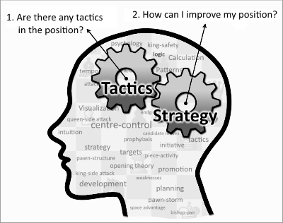

Finally, everything is ready to generate move explanations.
Over the last few weeks we:

* selected a notation to represent the board state
* trained an autoencoder to test said representation
* generates simple move descriptions

We did all this to prepare for this moment!

### Explaining chess moves
Back in the [fourth post](https://robinweitzel.github.io/nn-project/2019-04-23-gathering-data/) we found 3683 annotated games (yielding 17615 annotated moves).
Generating captions from this dataset is easy.
[Last week](https://robinweitzel.github.io/nn-project/2019-05-13-simple-captions/) we already built the network.
Now all we need to do is swap out the dataset with the annotated moves.
Unfortunately the results are abysmal.
After training for 5 epochs the validation accuracy is below 8%.
Why?

When we selected the dataset I mentioned that generating explanations would be very difficult.
Take a look at a game:

~~~
e2e4 
c7c5 Although Shirov has played a variety of defenses, I think he's been playing the Petroff's Defense and perhaps the Caro-Kann most recently.
g1f3 
b8c6 
d2d4 
c5d4 
f3d4 
e7e5 Neo-Sveshnikov or Lowenthal leaves d5 (and perhaps d6) weak. More common is 4...Nf6, forcing White to defend Pe4 and threatening ...d5.
d4b5 
d7d6 
b1c3 He threatens Nc3-d5 and Nc7+, so Black must nip that idea in the bud.
a7a6 
b5a3 
b7b5 Instead of White dominating square c4 it's Black who controls it, for the moment. Eventually piece play should dominate a position more than pawns. There is also the immediate threat of ...b4.
c3d5 White could continue with Bc1-e3-b6 and Nc7+, so Black has to react quickly.
c6e7 
c2c4 
e7d5 
e4d5 This makes the pawns a bit unbalanced with White advancing on the queen-side. Aside from Pb5 Black shouldn't have much difficulty completing his development.
b5c4 
a3c4 Now White controls c4!
g8f6 
c1e3 
a8b8 
f1e2 
f8e7 
a2a4 aiming for a4-a5 and Nb6 or Bb6 to cramp Black, but making Pb2 backward! That and the slightly exposed Pd5 make White's position suspicous. Where's his offense coming from? I suppose he thinks it's necessary to use a Nb6 to defend Pd5, but ...Nf6-d7 can chase a Nb6 away, exposing Pb2. If he continues his queen-side advance then one of the pawns gives him the advantage. So, where's Black's offense come from?
e8g8 
e1g1 
c8b7 The bishop is badly placed on the b-file.
c4b6 
f6d7 There it is! But, does it really work?
a4a5 
f7f5 
f2f3 
d7b6 
e3b6 
d8d7 keeping a foot planted firmly on both the queen- and king-side and preparing some kind of king-side offensive
b2b4 If it's backward then trade it off. In this case b4-b5xa6 would make a passed pawn; ...a6xb5 does the same.
e7d8 
b6e3 
d8f6 threatening ...f4 and ...e5-e4-e3, but once that threat is avoided then what is Bf6 doing?
a1b1 Keeping the rook on the a-file, to back up Pa5, might be appealing, but Pb4 needs more immediate support.
b8c8 
b4b5 
a6b5 
b1b5 
e5e4 Mostly desperation I think. White's offense is rolling along nicely and Black has none.
f3e4 White doesn't want to play f3-f4 and leave Black with a protected passed pawn at e4. And, I understand that feeling. However, to open lines means to give Black other possibilities.
f8e8 
b5b4 defending Pe4 and threatening Be2-b5 or a5-a6 seems correct
f6c3 Now begins a forcing sequence. White doesn't want to move Rb4, so he threatens Black.
e2b5 
d7d8 
b5e8 
c3b4 Now what? Be8 and Pa5 are threatened. Obviously Be8 needs to move and threaten something or White needs to threaten Bb4 or Kg8.
e8c6 
b7a6 If Black can't trade off Bb7 then he's just lost a valuable tempo and White can take the advantage in the center by capturing Pf5. Pa5 becomes a casualty of the campaign.
f1f5 
b4a5 
h2h3 
c8b8 
g1h2 tries to make the king safer, but might be wasting a valuable tempo
g7g6 Why weaken the king's position when there is still room for piece activity improvements.
e3g5 
d8c7 
f5f3 After this it's difficult to find a good move for Black, despite there being no direct threat.
b8b4 
g5h6 
b4b8 
d1a1 
a6e2 
f3f2 
e2d3 
a1f6 and checkmate is unavoidable. The weakening ...g6 has to be blamed for part of this mess.
~~~

Most comments don't form proper sentences.
The structure differs wildly from sentence to sentence.
Moves in chess notation are interspersed, often without making it clear to which player these moves belong.
Some comments think multiple turns ahead outlining complex exchanges while other ask rhetorical questions.
And this is just in one game!

Traditionally, caption generating system relied heavily on short sentences with similar structure and simple meanings.
No surprise that generating captions from these comments fails.
If we want any chance at decent results we need to introduce some structure to the explanations.
To do that, let's look at some common themes within the comments.

### Introducing structure to comments
To structure these comments I came up with simple rules to transform a complex sentence into a simple statement.
The rules I outline below are extremely basic.
A lot of information is lost and sometimes the rules extract the wrong thing.
They are just meant as a starting-point, an example.
The complex nature of the move explanations make defining perfect extraction rules an almost impossible task way outside of the scope of this project.
However, my simple rules can easily be replaces with more sophisticated at a later time.

The easiest concept is good and bad.
Many comments remark on the quality of a move.
For bad moves, the key phrases in chess are "mistake" and "blunder".
So let's just replace every sentence containing one of these words with "This move is a mistake".

Next, comments often talk about offense.
The key terms here are "threatens" and "attacks".
In contrast to the above rule, simply noting that a move attacks is not good enough.
Instead, we need to know which square/piece is being attacked.
Thus, the rule transforms sentences into "This move threatens Nb6" by taking the first move/piece mentioned after the key term.

Lastly, when talk about offense we also need to mention defense.
"Defends" and "protects" are the key phrases.
Once again the square also has to be extracted so we end up with a rule similar to the above attach-rule.

I'm sure you could think of more concepts and keywords but as a simple example this shall suffice.
Applying this ruleset on the commented games leaves us with 1572 moves.
That is way to few moves for any meaningful training and running the model does not yield any notable improvements.

### Conclusion
So that's it.
We ultimately failed?

First off, our experiments up until this point worked great.
Much more importantly, the available data is just not good enough fro training.
We have to few annotated games and most of the comments we have are unstructured, off-topic and very complex.

When thinking about why a certain move is good or bad there are two approaches: tactical vs positional.
Most comments focus on tactics.
Long sequences of moves planned ahead for multiple turns that lead to winning a piece or the game.
These are hard to follow even for a human, much more so for a computer but are more interesting.
Getting these right is the long-term plan but not feasible right now.

Comments on position are easier to generate.
They simply look at the static board and mention the immediate impact of the last move.
Explanations like "This move strengthens the e-file" or "This prevents the capture on f5".
They can be formulated as simply statements containing a verb (describing the action) and a piece or square.
That is what I tried to generate in the previous chapter.
Unfortunately our dataset only contains very few of these (and then not structured nicely).

However, this project demonstrates that generating such explanations is realistic.
All we need is a better dataset.
One possible source could be the multitude of chess books focused on [positional chess](https://www.goodreads.com/shelf/show/chess-positional).
But that is for another project :)

You can check out the code for this final blog post [here](https://github.com/RobinWeitzel/nn-project/blob/master/move_explanations.ipynb)